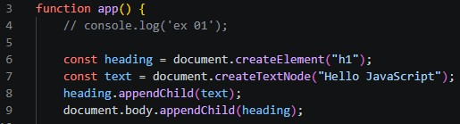
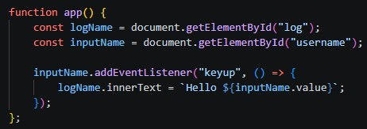
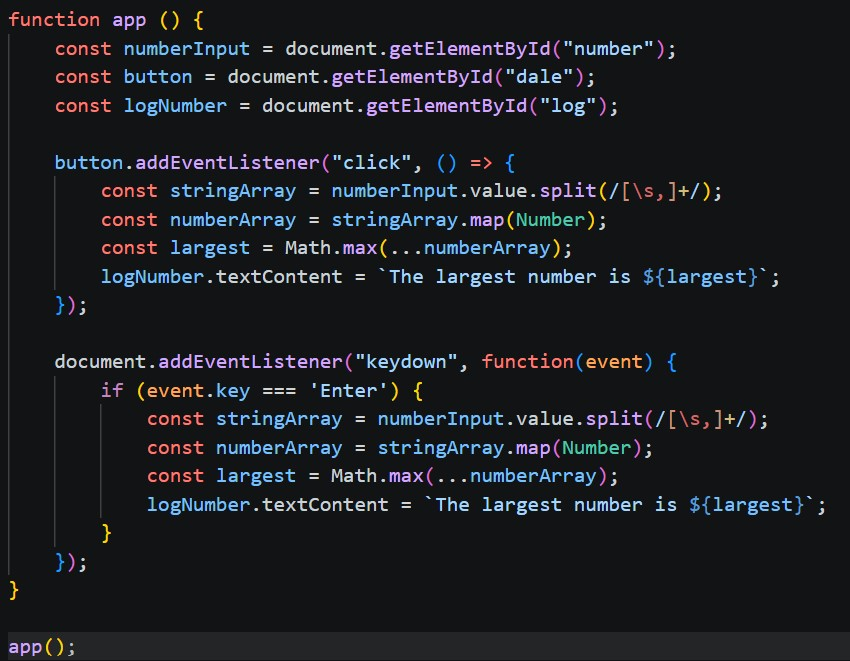

# EX - P5 - JavaScript - Micro Exercises

## EX - 01

Escribe un programa que escriba en la pantalla un texto de tipo `<h1>` que diga “Hello Javascript”.

### Resultado:

---

## EX - 02

Escribe un programa que pida el nombre del usuario con un input y escriba un texto que diga “Hola `<nombre-de-usuario>`”.

### Pasos a seguir:
- Input que pida texto (nombre de usuario como `placeholder`)
- Introducir nombre
- Script que recoja este nombre
- Devolver un texto que diga "Hola + nombre introducido"

### Resultado:

---

## EX - 03

Escribe un programa que pida 3 números y escriba en la pantalla el mayor de los tres.

### Pasos a seguir

- Input numérico
- Botón con el que validar los tres números
- Si no son tres números, lanzar error
- Recoger los datos del input
- Devolver impreso en pantalla el número más grande

### Resultado:

---

## EX - 04

Escribe un programa que pida una frase y escriba cuantas veces aparece la letra `a`.

### Pasos a seguir:

- Crear input de texto
- Botón que 

### Resultado:

N/A

---

## EX - 05

N/A

---

## EX - 06

Escribe un programa que pida dos números, que el usuario pueda elegir suma o resta y escriba `“La suma de con es ”` o `“La resta de con es ”`.